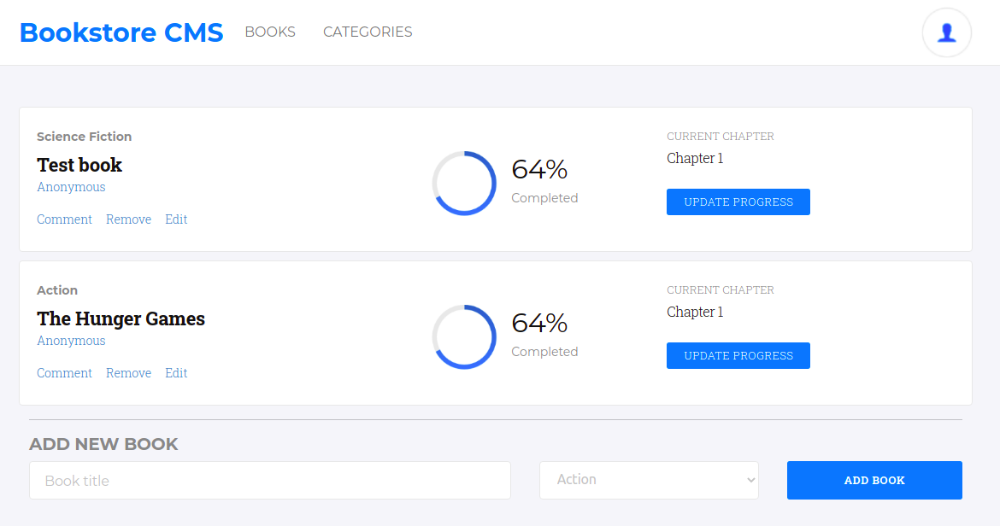

# Bookstore

> This project consists of a Single Page App that allows users to create and remove books. It persist the data in an external API. This is built with React and Redux.

## Built With

- HTML
- CSS
- Javascript
- React - Redux
- Bootstrap

## Live Demo

[Bookstore](https://dazzling-torvalds-218638.netlify.app)

## Getting Started

To get a local copy up and running follow these simple example steps:
- Clone the repo to your computer.
In the project root folder: 
- Run "npm install" to install all the dependencies.
- Run "npm start" to see it working on your browser.

👤 **Nacho Sala**

- GitHub: [@nachosala89](https://github.com/nachosala89)
- Twitter: [@nachosala89](https://twitter.com/nachosala89)
- LinkedIn: [Juan Ignacio Sala](https://www.linkedin.com/in/nacho-sala)

## 🤝 Contributing

Contributions, issues, and feature requests are welcome!

Feel free to check the [issues page](https://github.com/nachosala89/bookstore/issues).

## Show your support

Give a ⭐️ if you like this project!

## 📝 License

This project is [MIT](./MIT.md) licensed.